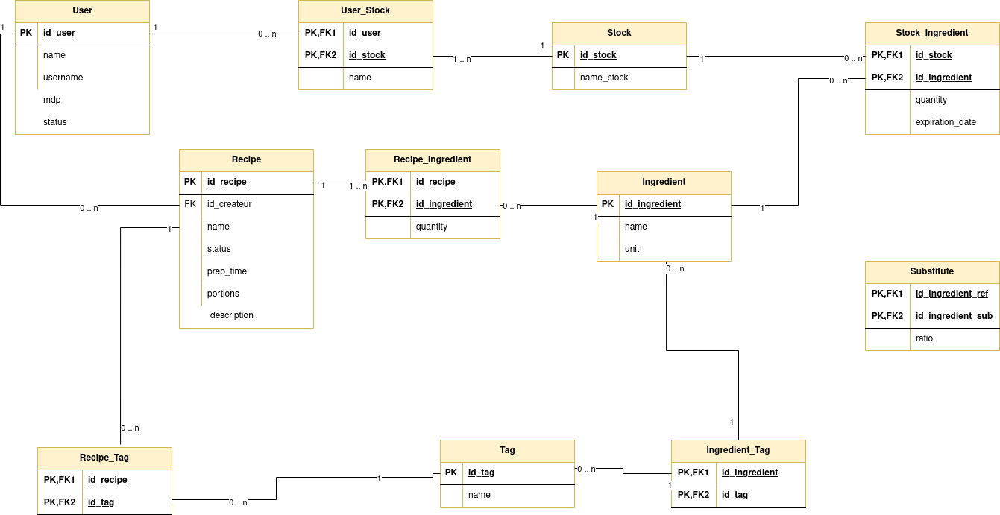

# 📦 Projet : Logiciel de gestion et de recherche de recettes

Ce projet a pour objectif de développer un **logiciel de gestion de stock alimentaire et de recherche de recettes** permettant à des utilisateurs de retrouver des recettes à partir des ingrédients dont ils disposent, tout en gérant un stock personnel et des contraintes alimentaires.

Le projet est réalisé dans le cadre du **module de création logicielle** et suit une approche structurée :

- architecture MVD (Modèle – Vue – Données),
- séparation claire frontend / backend,
- bonnes pratiques de développement,
- qualité et maintenabilité du code,
- tests automatisés.

______________________________________________________________________

## 🎯 Objectifs du projet

- Permettre la recherche de recettes à partir d’ingrédients disponibles
- Gérer un stock d’ingrédients par utilisateur
- Proposer une application multi-utilisateur sécurisée
- Mettre en place une architecture claire et évolutive
- Respecter les conventions de développement (PEP 8, bonnes pratiques JavaScript)

______________________________________________________________________

## 🧩 Fonctionnalités

### Fonctionnalités de base (Niveau 1)

- Création de comptes utilisateurs et authentification
- Ajout et gestion des ingrédients
- Gestion d’un stock personnel par utilisateur
- Recherche de recettes dont tous les ingrédients sont disponibles
- Gestion multi-utilisateur

### Fonctionnalités avancées (Niveau 2)

- Recherche de recettes avec :
  - ajout dynamique d’ingrédients disponibles
  - restrictions (ingrédients exclus, calories, origine des recettes…)
- Gestion automatique du stock
- Ajout d’ingrédients via ticket de caisse

______________________________________________________________________

## 🏗️ Architecture générale

L’application repose sur une architecture **MVD (Modèle – Vue – Données)** :

```
Interface utilisateur  <->  Métier  <->  Base de données
```

- **Interface utilisateur (Vue)** : interaction avec l’utilisateur via une application web (React)
- **Métier (Modèle)** : logique applicative, règles de gestion, authentification
- **Données** : persistance des utilisateurs, recettes, ingrédients et stocks

### 🗄️ Base de données

La base de données PostgreSQL gère les entités principales du projet :

- Utilisateurs
- Sessions (authentification JWT)
- Ingrédients
- Stocks
- Recettes
- Relations utilisateur / stock

📌 Diagramme de la base de données :\


______________________________________________________________________

### 🖥️ FrontEnd

Le frontend est développé avec **React** et **Vite**.

📘 Documentation détaillée :\
[README du frontend](src/frontend/README.md)

Fonctionnalités principales :

- Inscription et connexion des utilisateurs (JWT)
- Communication sécurisée avec l’API backend
- Gestion du stock et affichage des recettes

______________________________________________________________________

### 🖥️ Interface utilisateur

L’interface utilisateur permet :

- la création de comptes et la connexion des utilisateurs,
- la consultation et la gestion du stock personnel,
- la recherche de recettes en fonction des ingrédients disponibles.

Elle est conçue pour être :

- simple d’utilisation,
- réactive,
- évolutive.

______________________________________________________________________

### ⚙️ Modèle métier

Le modèle métier regroupe :

- les règles de gestion des utilisateurs,
- la logique d’authentification (JWT),
- la gestion des stocks et des ingrédients,
- les règles de recherche de recettes.

Il est implémenté côté backend avec **FastAPI** et suit une séparation claire entre :

- objets métiers,
- accès aux données (DAO),
- logique applicative (services).

______________________________________________________________________

## ⚙️ Lancement du projet

### Prérequis

- Node.js 20+
- npm
- Python 3.11+
- Docker & Docker Compose

### 1️⃣ Lancer la base de données

```bash
docker compose up -d
```

### 2️⃣ Lancer le backend

```bash
uv run uvicorn src.backend.api.main:app --reload
```

Backend accessible sur :\
👉 http://127.0.0.1:8000

### 3️⃣ Lancer le frontend

```bash
cd src/frontend
npm install
npm run dev
```

Frontend accessible sur :\
👉 http://localhost:5173

______________________________________________________________________

## 🔐 Configuration (.env)

### Backend

Exemple de variables d’environnement :

```env
PYTHONPATH=src

POSTGRES_HOST=localhost
POSTGRES_PORT=5432
POSTGRES_DATABASE=projet2a
POSTGRES_USER=projet_user
POSTGRES_PASSWORD=projet_pwd

POSTGRES_SCHEMA=projet_dao
```

### Frontend

Voir le fichier :

```bash
src/frontend/.env.local.template
```

______________________________________________________________________

## 🧪 Qualité et outils

- Tests automatisés backend avec **pytest**
- Linting et formatage via **pre-commit**
- Workflows CI pour les tests

📎 Ressources :

- [Guide pre-commit](Documentation/Infos_divers/pour_pre_commit.md)
- [Workflows de tests](Documentation/Infos_divers/worklows.md)

______________________________________________________________________

## 📅 Compte-rendus de réunions

- Vendredi 23 janvier : [Réunion 1](Documentation/reunion_construction/reunion1_23_01.md)
- Vendredi 30 janvier : [Réunion 2](Documentation/reunion_construction/reunion2_30_01.md)
- Vendredi 1 février : lien perdu

______________________________________________________________________

📌 _Ce README décrit l’état actuel du projet et pourra évoluer avec l’ajout de nouvelles fonctionnalités._
